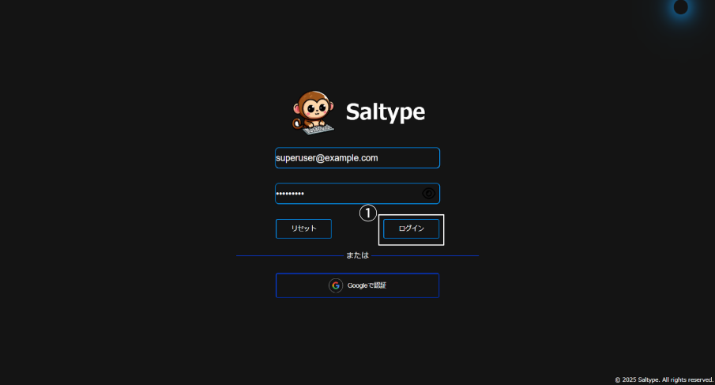
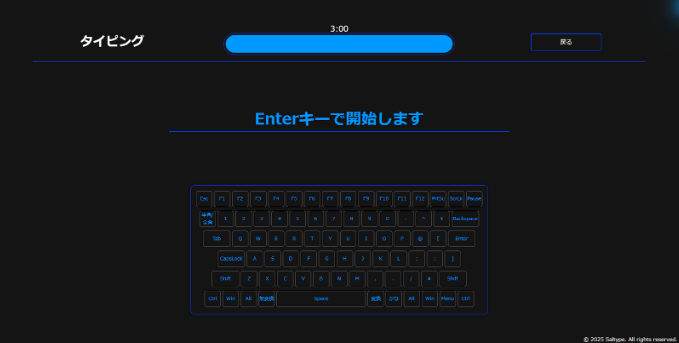

  

<h1 align="center">Saltypeユーザ操作ガイド</h1>

## 目次
- [目次](#目次)
- [ログイン](#ログイン)
- [ログアウト](#ログアウト)
- [タイピング練習](#タイピング練習)
  - [言語](#言語)
  - [難易度](#難易度)
- [タイピング結果表示](#タイピング結果表示)
- [ランキング表示](#ランキング表示)
- [分析情報表示](#分析情報表示)
- [要望送信](#要望送信)
- [アプリデザインカスタマイズ](#アプリデザインカスタマイズ)
- [ユーザ情報設定](#ユーザ情報設定)
  - [ユーザ情報表示](#ユーザ情報表示)
  - [ユーザ名変更](#ユーザ名変更)
  - [ユーザパスワード変更](#ユーザパスワード変更)
- [ユーザ管理(管理者ユーザのみ)](#ユーザ管理管理者ユーザのみ)
  - [ユーザ情報一覧表示](#ユーザ情報一覧表示)
  - [ユーザ検索](#ユーザ検索)
  - [ユーザスコアソート](#ユーザスコアソート)
  - [ユーザランク絞り込み](#ユーザランク絞り込み)
  - [ユーザ情報編集](#ユーザ情報編集)
  - [ユーザ情報削除](#ユーザ情報削除)

---

## ログイン
サイトURLにアクセスすると以下の画面が表示されます。以下、2種類の方法でログインが可能です。

1. **メールアドレスとパスワードを入力しログインボタンを押下**
   - 

2. **Googleで認証ボタンを押下**
   - 

ログインに成功するとホーム画面が表示されます。

---

## ログアウト
①のログアウトボタンを押下することによってログアウトできます。

---

## タイピング練習
ホーム画面の①言語選択、②難易度選択で、タイピング練習がしたい言語とその難易度を選択できます。選択できる言語と難易度は以下の通りです。

### 言語
- 日本語
- 英語

### 難易度
- イージー
- ノーマル
- ハード

③のスタートボタンを押下すると選択した言語と難易度のタイピング練習画面に遷移します。 

Enterキーを押すことで３秒のカウントダウンの後、タイピング練習が開始されます。 

④に表示されている文字の通りタイピングしていくことでタイピングの練習ができます。また、⑤の戻るボタンを押下することでホーム画面に戻ることができます。 

---

## タイピング結果表示
３分のタイピング練習が終了すると、タイピング結果画面に移行します。各項目の詳細は以下の通りです。

1. **今回のスコア**  
   - 今回のタイピング練習で獲得したスコア※が表示されます。

2. **平均スコア**  
   - 選択した言語と難易度の平均スコアが表示されます。

3. **ランク**  
   - 今回獲得したスコアに基づくランクが表示されます。

4. **ランキング**  
   - 選択した言語と難易度でのランキングが表示されます。

※スコアは「正タイプ数（正しくタイピングできた回数）×正確度（全タイピング数のうち正タイプをどれだけしたか）×10」で計算されます。

また、⑤の戻るボタンを押すことでホーム画面に戻ることができます。

⑥のランク詳細ボタンを押下すると獲得可能なランクの一覧が表示されます。
   

⑦の戻るボタンを押下するとタイピング結果画面に戻ることができます。

⑧のスタートボタンを押下すると現在の設定で表示されている言語、難易度でタイピング練習にリトライできます。

⑨の全体ランキングへボタンを押下するとランキング画面に遷移できます。

---

## ランキング表示
ランキングボタンを押下することでランキング画面に遷移します。以下、2種類の方法でランキングを表示することができます。

Ⅰ. ホーム画面①のランキングボタンを押下  
Ⅱ. タイピング結果画面⑨の全体ランキングへボタンを押下  

ランキング画面では、以下項目をスクロールすることで表示できます。

- **本日のチャンピオン**  
  - 各言語、難易度の本日1位のユーザが表示されます。

- **ランキング 日本語**  
  - 日本語の各難易度のランキングが5位まで表示されます。

- **ランキング 英語**  
  - 英語の各難易度のランキングが5位まで表示されます。

また、②の戻るボタンを押下することでホーム画面に戻ることができます。

③のもっと見るボタンを押下することでランキング詳細画面に遷移できます。

ランキング詳細画面では、選択した難易度、言語のランキングが21位まで表示されます。 
また、④の戻るボタンを押下することでランキング画面に戻ることができます。

---

## 分析情報表示
①の分析情報ボタンを押下することで分析情報画面に遷移することができます。

分析情報画面項目の説明は以下の通りです。

- **ミスタイプ頻度TOP10位**  
  - ユーザがしたミスタイプ回数とキー上位10位が表示されます。

- **成長グラフ**  
  - ユーザが獲得したスコアの推移のグラフが表示されます。カルーセルで各言語、難易度のグラフ表示ができます。

また、③の戻るボタンを押下することでホーム画面に戻ることができます。

---

## 要望送信
ホーム画面の①ご要望ボタンを押下することで要望送信画面に遷移できます。

要望内容ボックスに要望内容を入力し②送信ボタンを押下することで要望を送信できます。①のリセットボタンを押下することで要望内容のリセットができます。

また、③の戻るボタンを押下することでホーム画面に戻ることができます。

---

## アプリデザインカスタマイズ
ホーム画面①のカスタマイズボタンを押下することでカスタマイズパレットが表示されます。

カスタマイズパレットで以下項目の色を変更することができます。

- テキストの色
- 背景の色
- メインアイテムの色
- サブアイテムの色
- アイテムにカーソルを当てた時の色

また、②閉じるボタンを押下することでホーム画面に戻ることができます。

---

## ユーザ情報設定
ホーム画面①ユーザ設定ボタンを押下することでユーザ設定画面に遷移できます。

### ユーザ情報表示
②ユーザ情報ボタンを押下することによってユーザ情報表示カードに切り替わります。現在ログインしているユーザのユーザ名とメールアドレスが表示されます。

### ユーザ名変更
③ユーザ名変更ボタンを押下することによってユーザ名変更カードに切り替わります。変更したいユーザ名を入力し⑤送信ボタンを押下することでユーザ名を変更することができます。また、④リセットボタンを押下することでユーザ名入力のリセットができます。

### ユーザパスワード変更
パスワード変更ボタンを押下することによってユーザ名変更カードに切り替わります。現在とパスワードと変更後のパスワードを入力し⑧送信ボタンを押下することでパスワードを変更することができます。⑦リセットボタンを押下することでパスワード入力のリセットができます。現在のパスワードが違うとパスワードを変更することができません。

---

## ユーザ管理(管理者ユーザのみ)
ホーム画面①ユーザ管理ボタンを押下することでユーザ管理画面に遷移できます。

### ユーザ情報一覧表示
登録されているすべてのユーザの情報が表示されます。ユーザ管理画面で一覧表示される情報の説明は以下の通りです。

- **ユーザ名**  
  - 登録されているすべてのユーザのユーザ名が表示されます。

- **メールアドレス**  
  - 登録されているすべてのユーザのメールアドレスが表示されます。

- **最高スコア**  
  - 登録されているすべてのユーザの本日の最高スコアが表示されます。

- **ランク**  
  - 登録されているすべてのユーザのランクが表示されます。

### ユーザ検索
⑤の入力欄にユーザ名またはメールアドレスを入力することでユーザの検索ができます。

### ユーザスコアソート
⑥ユーザソートボタンを押下することによって、ユーザをスコア降順や昇順に並べることができます。

### ユーザランク絞り込み
ランク絞り込みプルダウンメニューでランクを選択することによって、ユーザをランクで絞り込むことができます。

### ユーザ情報編集
⑧ユーザ情報編集ボタンを押下することによって、ユーザ情報の編集が可能になります。⑨ユーザ名入力欄、⑩メールアドレス入力欄に変更後のユーザ名、メールアドレスを入力し⑪保存ボタンを押下することによって、ユーザ情報編集ができます。また、⑫キャンセルボタンでユーザ情報編集をキャンセルすることができます。

### ユーザ情報削除
⑬ユーザ情報削除ボタンを押下することによってユーザ情報の削除警告ポップアップが表示されます。⑭はいボタンを押下することによってユーザ情報の削除が完了します。⑮いいえボタンを押下することによってユーザ情報の削除をキャンセルできます。

⑭はいボタンを押下することによってユーザ情報の削除が完了します。
⑮いいえボタンを押下することによってユーザ情報の削除をキャンセルできます。

      